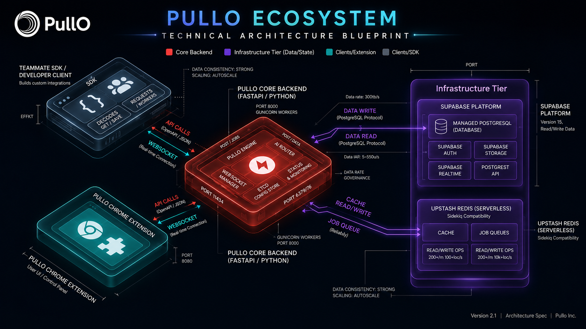
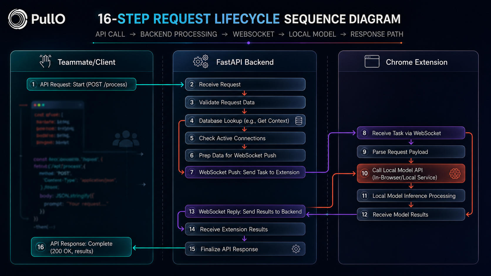

<div align="center">


# Connect your local AI to your team.

**PullO is a private AI network layer that turns local models (Ollama, LM Studio, llama.cpp) into secure, team-accessible OpenAI-compatible APIs. No port forwarding. No tunnels. No cloud inference bills.**

[](https://pullo.runtimeco.qzz.io)
[](LICENSE.md)
[](https://pullo.runtimeco.qzz.io)

[🌐 Website](https://pullo.runtimeco.qzz.io) •
[🚀 Live Demo — Coming Soon](#) •
[📖 Documentation](./docs) •
[🎥 Demo Video — Coming Soon](#) •
[📊 Pitch Deck — Coming Soon](pitch/)

</div>

---

## About This Repository

This repo hosts PullO's public website, documentation, brand assets, and showcase materials. The platform itself — API routing, auth, and extension runtime — is closed-source and maintained separately.

> **Judge note:** The private monorepo ([github.com/mrinmoyChakraborty-mrinox/PullO](https://github.com/mrinmoyChakraborty-mrinox/PullO)) with backend + extension source is under active development but frozen for judging. See [`evidence/private-repo-verification.md`](./evidence/private-repo-verification.md) for verifiable commit activity, metadata, and screenshots confirming the repository exists and is actively maintained. Public deployment + open-source release follow after evaluation.

---

## The Problem

Running AI locally has never been easier. A single `ollama pull` gives any developer a state-of-the-art LLM on their laptop. But sharing that model with a teammate, an agent, or a CI pipeline is still a networking headache.

The standard approach is port forwarding — punching a hole in your firewall so inbound traffic can reach your machine. That works until your ISP doesn't give you a public IP, your corporate VPN blocks inbound connections, or you need to share access with more than one person without exposing your entire machine.

Tools like ngrok and Cloudflare Tunnels improve on raw port forwarding, but they were built for web services, not AI. They expose the machine itself, not a scoped API. Every teammate you share the URL with gets raw access to whatever is listening on that port. There's no API key scoping, no per-model access control, no usage tracking.

Teams that need multi-user access to local models end up stitching together SSH jump boxes, VPN configs, reverse proxies, and ad‑hoc auth layers. It works, barely, until someone changes their IP or the tunnel drops. And none of it was designed for the streaming, tool-calling, multi-model workflows that modern local AI demands.

---

## The Solution

PullO replaces the entire networking layer with a pull-based model. Instead of opening an inbound port, a lightweight browser extension on your machine establishes a single persistent outbound WebSocket connection to PullO's cloud relay. The extension then polls for incoming requests.

When a teammate calls your model via the OpenAI-compatible API, the request is authenticated, validated, and forwarded over that WebSocket to your extension. The extension calls your local provider (Ollama, LM Studio, llama.cpp, or any OpenAI-compatible endpoint), streams the response back through the relay, and the caller receives a standard OpenAI response — without ever knowing where the model actually ran.

Your machine is never directly reachable. There are no open ports, no dynamic DNS, no VPN. The model stays local; only the API surface is shared.

This design works behind any NAT, firewall, or corporate proxy. If your machine can reach the internet, PullO can serve requests to it.

---

## Why PullO

| | Traditional Tunneling (ngrok, Cloudflare) | PullO |
|---|---|---|
| **Connection model** | Inbound port forwarding (push) | Outbound WebSocket polling (pull) |
| **Firewall compatibility** | Blocked by corporate proxies | Works behind any NAT/proxy |
| **Machine exposure** | Entire port exposed to the internet | Zero inbound ports; machine unreachable |
| **Auth model** | Single URL, no built-in auth | Scoped API keys per workspace, per model |
| **Multi-user sharing** | Share a raw URL | Role-based team workspaces |
| **Usage tracking** | None | Per-request analytics, token counts, rate limits |
| **Provider support** | Web services only | Ollama, LM Studio, llama.cpp, OpenAI-compatible |
| **Streaming** | Depends on the tunnel | Native SSE streaming end-to-end |

---

## Features

| Icon | Feature | Description |
|------|---------|-------------|
| 🔌 | **OpenAI-Compatible API** | Drop-in replacement — use existing OpenAI SDKs without changing your application code |
| 🖥️ | **Browser Extension** | Lightweight Chrome extension establishes a secure outbound connection from your machine |
| 🧠 | **Local Provider Support** | Works with Ollama, LM Studio, and llama.cpp out of the box; any OpenAI-compatible endpoint works |
| 👥 | **Team Workspaces** | Organize members into isolated workspaces with shared model infrastructure and role-based access |
| 🔑 | **Scoped API Keys** | Generate keys with model-level access, tool permissions, rate limits, and usage controls |
| 📊 | **Usage Analytics** | Track requests, tokens, active models, and team activity per workspace |
| 📜 | **Request Logs** | Inspect individual AI requests for debugging and monitoring (prompts are never stored) |
| 🔒 | **Zero Inbound Ports** | Pull-based architecture means no open ports, no dynamic DNS, no VPN configuration |
| 🛠️ | **Browser Runtime Tools** | Extension injects browser capabilities — search, read, screenshot — as LLM tool calls |

---

## Screenshots

<details>
<summary><b>Landing Page</b></summary>
<br>


*Screenshot coming soon.*

</details>

<details>
<summary><b>Dashboard</b></summary>
<br>


*Screenshot coming soon.*

</details>

<details>
<summary><b>Models</b></summary>
<br>


*Screenshot coming soon.*

</details>

<details>
<summary><b>API Keys</b></summary>
<br>


*Screenshot coming soon.*

</details>

<details>
<summary><b>Analytics</b></summary>
<br>


*Screenshot coming soon.*

</details>

<details>
<summary><b>Browser Extension</b></summary>
<br>


*Screenshot coming soon.*

</details>

<details>
<summary><b>Workspace</b></summary>
<br>


*Screenshot coming soon.*

</details>

---

## Demo

🎥 Demo video — coming soon.

---

## Architecture

### High-Level System



```
                     ┌──────────────────────┐
                     │     Your Team Apps    │
                     │  (OpenAI SDK / Curl   │
                     │   / LangChain / ...)  │
                     └──────────┬───────────┘
                                │ pk_xxx API key
                     ┌──────────▼───────────┐
                     │    PullO Cloud Relay   │
                     │                        │
                     │  ┌──────────────────┐  │
                     │  │ Auth + Rate Limit│  │
                     │  │ + Request Queue  │  │
                     │  └────────┬─────────┘  │
                     └──────────┬───────────┘
                                │ WebSocket (outbound)
                     ┌──────────▼───────────┐
                     │  Chrome Extension     │
                     │  (pulls requests,     │
                     │   streams responses)  │
                     └──────────┬───────────┘
                                │ localhost
                     ┌──────────▼───────────┐
                     │    Local AI Runtime   │
                     │                        │
                     │  Ollama  │  LM Studio  │
                     │  llama.cpp │ Compatible │
                     └────────────────────────┘
```

### Request Lifecycle



```
┌─────────┐         ┌──────────┐         ┌───────────┐         ┌────────┐
│  Client │         │  PullO   │         │ Extension │         │ Local  │
│ (SDK)   │         │  Cloud   │         │ (Browser) │         │ Model  │
└────┬────┘         └────┬─────┘         └─────┬─────┘         └───┬────┘
     │                    │                     │                    │
     │  POST /v1/chat     │                     │                    │
     │  (Bearer pk_xxx)   │                     │                    │
     │───────────────────>│                     │                    │
     │                    │                     │                    │
     │                    │  Validate API key   │                    │
     │                    │  Check rate limit   │                    │
     │                    │  Check model online │                    │
     │                    │                     │                    │
     │                    │  Queue request      │                    │
     │                    │────────────────────>│                    │
     │                    │  (WebSocket push)   │                    │
     │                    │                     │                    │
     │                    │                     │  localhost:11434   │
     │                    │                     │───────────────────>│
     │                    │                     │                    │
     │                    │                     │  Generate response │
     │                    │                     │<───────────────────│
     │                    │                     │  (streaming SSE)   │
     │                    │  Stream response    │                    │
     │<───────────────────│                     │                    │
     │                    │                     │                    │
```

### Security Model

```
                          ┌──────────────────┐
                          │   Internet       │
                          │                  │
                          │  PullO Cloud     │
                          │  (reachable)     │
                          └────────┬─────────┘
                                   │
                     Only outbound │ WebSocket
                     No inbound    │
                     ports open    │
                                   │
                          ┌────────▼─────────┐
                          │   Your Machine   │
                          │                  │
                          │  ┌────────────┐  │
                          │  │ Extension  │  │
                          │  │ (Chrome)   │  │
                          │  └────────────┘  │
                          │         │        │
                          │  ┌──────▼─────┐  │
                          │  │ Ollama /   │  │
                          │  │ LM Studio  │  │
                          │  │ (localhost)│  │
                          │  └────────────┘  │
                          └──────────────────┘
```

---

More architecture diagrams — including backend server structure, extension internals, and detailed flowcharts — are available in the [diagrams/](./diagrams) directory.

## Tech Stack

PullO's public-facing and client-side components are built with:

| Layer | Technology |
|-------|-----------|
| **Frontend** | Next.js, React 19, TypeScript |
| **Styling** | Tailwind CSS 4, shadcn/ui, Framer Motion |
| **3D / Visuals** | Three.js, React Three Fiber, GSAP, Lenis |
| **Auth (frontend)** | Supabase Auth (email + Google OAuth) |
| **Charts** | Recharts |
| **Docs** | Next.js 15, MDX, Fuse.js search |
| **Browser Extension** | Manifest V3 (Chrome) |
| **Local Providers** | Ollama, LM Studio, llama.cpp (any OpenAI-compatible endpoint) |
| **Analytics** | Vercel Analytics |
| **Error Monitoring** | Sentry |
| **Icons** | Lucide React |

---

## Quickstart / API Example

PullO exposes a standard OpenAI-compatible API. Use any OpenAI SDK by changing the base URL and API key.

```bash
curl https://api.pullo.ai/v1/chat/completions \
  -H "Authorization: Bearer pk_xxxxxxxxx" \
  -H "Content-Type: application/json" \
  -d '{
    "model": "deepseek-r1",
    "messages": [
      {
        "role": "user",
        "content": "Hello!"
      }
    ]
  }'
```

```python
from openai import OpenAI

client = OpenAI(
    base_url="https://api.pullo.ai/v1",
    api_key="pk_xxxxxxxxx"
)

response = client.chat.completions.create(
    model="deepseek-r1",
    messages=[{"role": "user", "content": "Hello!"}]
)

print(response.choices[0].message.content)
```

```js
import OpenAI from 'openai'

const client = new OpenAI({
  baseURL: 'https://api.pullo.ai/v1',
  apiKey: 'pk_xxxxxxxxx'
})

const response = await client.chat.completions.create({
  model: 'deepseek-r1',
  messages: [{ role: 'user', content: 'Hello!' }]
})

console.log(response.choices[0].message.content)
```

Streaming, embeddings, and tool/function calling all work with the same interface.

---

## Repository Structure

```
PullO-Showcase/
├── README.md              ← You are here
├── LICENSE.md             # Proprietary license
├── backend/               # Backend platform documentation (closed-source)
├── docs/                  # Full documentation site (Next.js + MDX)
├── frontend/              # Landing page and dashboard app (Next.js)
├── screenshots/           # Product screenshots
├── branding/              # Logo, color palette, brand assets
├── media/                 # Press kit, social graphics, slide decks
├── diagrams/              # Architecture and flow diagrams
├── examples/              # Code examples and integration guides
└── pitch/                 # Pitch deck and investor materials
```

---

## Documentation

- [Vision](./docs/app/vision) — Product vision and long-term strategy
- [Architecture](./docs/app/architecture) — System architecture deep-dive
- [API Reference](./docs/app/api-reference) — Full API endpoint documentation
- [Quickstart](./docs/app/quickstart) — Get started in 5 minutes
- [Extension Overview](./docs/app/extension) — Browser extension setup and config
- [Deployment Overview](./docs/app/deployment) — Deployment considerations
- [FAQ](./docs/app/faq) — Frequently asked questions
- [Roadmap](./docs/app/roadmap) — What's coming next
- [SDKs](./docs/app/sdks) — Supported client libraries
- [Tools](./docs/app/tools) — Browser runtime and MCP tool reference
- [MCP](./docs/app/mcp) — Model Context Protocol integration
- [Teams](./docs/app/teams) — Workspace and team management
- [CLI Agents](./docs/app/cli-agents) — CLI agent setup
- [Troubleshooting](./docs/app/troubleshooting) — Common issues and fixes
- [Changelog](./docs/app/changelog) — Release history

---

## Roadmap

### Now
- Team workspaces with role-based access
- Chrome browser extension
- Ollama, LM Studio, and llama.cpp support
- OpenAI-compatible chat completions and embeddings API
- API key management with scoped permissions
- Usage analytics and request logging
- Browser runtime tool integration (search, read, screenshot)

### Next
- Model routing across multiple local providers
- MCP (Model Context Protocol) tool gateway
- Enterprise SSO and SAML authentication
- Desktop client (Electron)
- Rate limiting and budget controls per API key
- Public API playground

### Later
- Shared tool marketplace
- Custom webhook tool support
- Team billing and subscription management
- Provider marketplace (community extensions)
- Self-hosted relay option
- Audit logging and compliance export

---

## Team

PullO is built by **Runtime.co**, a student-led, developer-first team building AI infrastructure. We believe local AI deserves the same collaboration tooling that cloud AI has enjoyed — without forcing every model onto a GPU rented by the hour.

---

## FAQ

**How is this different from ngrok?**
ngrok exposes a port on your machine to the internet. PullO opens no ports — requests are pulled via an outbound WebSocket connection initiated by the extension. Your machine is never directly reachable.

**Do my models leave my machine?**
No. Models run locally on your hardware. PullO relays only the API request and response payloads. Prompts are never stored on our servers.

**What local providers are supported?**
Ollama, LM Studio, and llama.cpp are supported out of the box. Any process that exposes an OpenAI-compatible endpoint can also be connected.

**Can I use this behind a corporate VPN or firewall?**
Yes. The browser extension uses a single outbound WebSocket connection, which works through NAT, corporate proxies, and restricted networks where inbound tunnels are blocked.

**Do I need a cloud GPU or inference provider?**
No. All inference runs locally on the machine where the extension is installed. PullO is a relay, not an inference provider.

**Is there a free tier?**
PullO is currently in early access. Pricing and tier details will be announced as we approach general availability.

---

<div align="center">

**Local AI deserves better collaboration.**

Built by [Runtime.co](https://pullo.runtimeco.qzz.io) — Copyright © 2026 Runtime.co. All rights reserved.

[Website](https://pullo.runtimeco.qzz.io) • [License](LICENSE.md)

</div>
