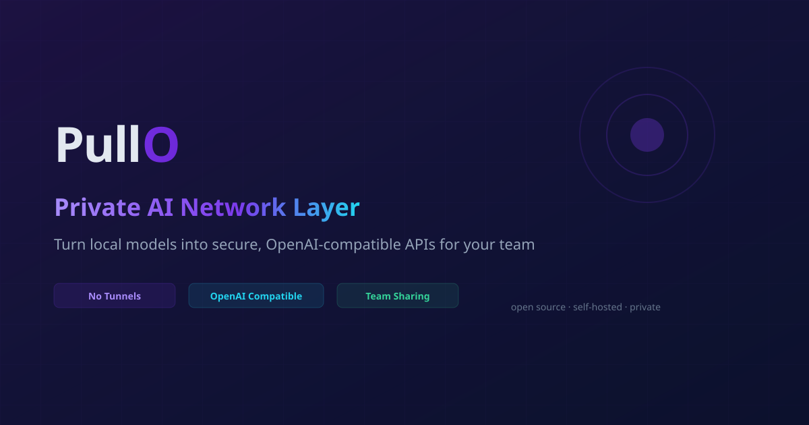

# Branding

PullO brand assets, color palette, typography, and logo files.

---

## Logo

### SVG (Primary)

### PNG

---

## Favicon

Favicon set for all platforms — available in the [pullo_favicon](../frontend/public/pullo_favicon/) directory:

| Size | File |
|------|------|
| 16×16 | [`favicon-16x16.png`](../frontend/public/pullo_favicon/favicon-16x16.png) |
| 32×32 | [`favicon-32x32.png`](../frontend/public/pullo_favicon/favicon-32x32.png) |
| 192×192 | [`android-chrome-192x192.png`](../frontend/public/pullo_favicon/android-chrome-192x192.png) |
| 512×512 | [`android-chrome-512x512.png`](../frontend/public/pullo_favicon/android-chrome-512x512.png) |
| Apple Touch | [`apple-touch-icon.png`](../frontend/public/pullo_favicon/apple-touch-icon.png) |

## OG Image

Social sharing preview image:

