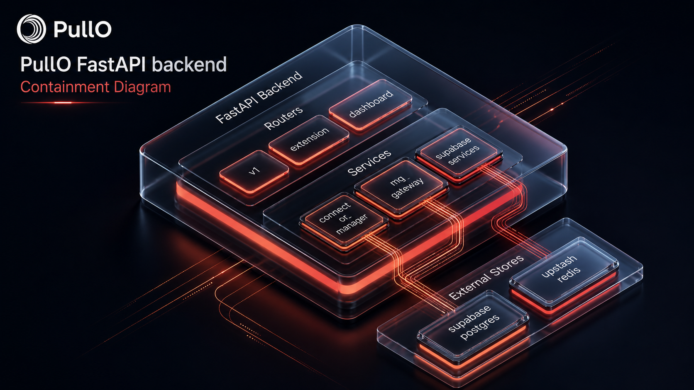
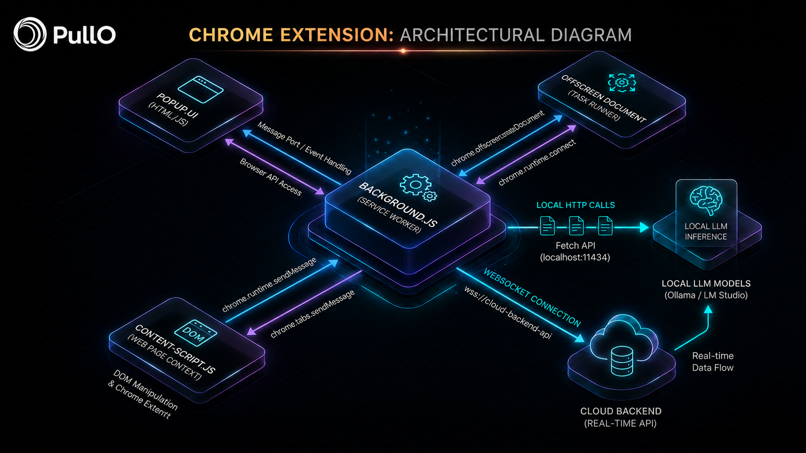

# Diagrams

Architecture, flow, and system diagrams for PullO.

---

## PNG Diagrams

### Technical Architecture

Full system architecture — team apps → cloud relay → extension → local AI.

### Request Life Cycle

Request flow from client through cloud relay, extension WebSocket, to local model and back.

### FastAPI Backend

Backend server architecture, component layout, and API surface structure.

### Extension Architecture

Chrome extension internals, WebSocket connection flow, and tool injection pipeline.

---

## Text Diagrams

- [architecture-overview.txt](./architecture-overview.txt) — High-level system architecture diagram
- [request-lifecycle.txt](./request-lifecycle.txt) — Detailed request flow with timing and edge cases
- [security-model.txt](./security-model.txt) — Zero-trust security model with attack surface analysis

---

## Planned

- Authentication flow diagram
- Extension connection state machine
- Team workspace hierarchy diagram
- Deployment topology illustration
