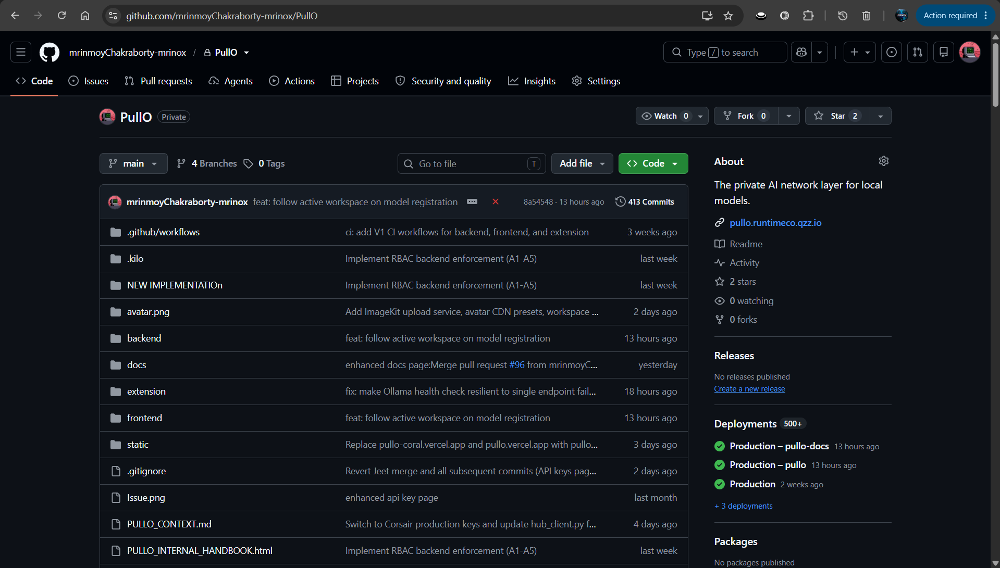
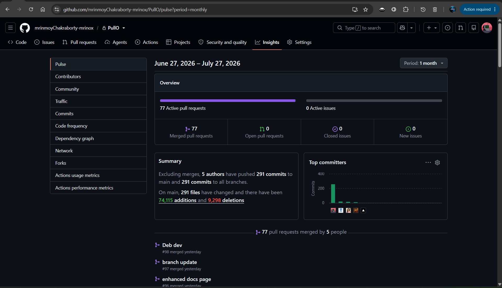
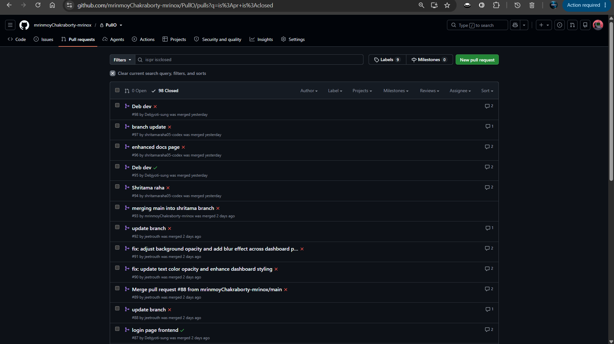
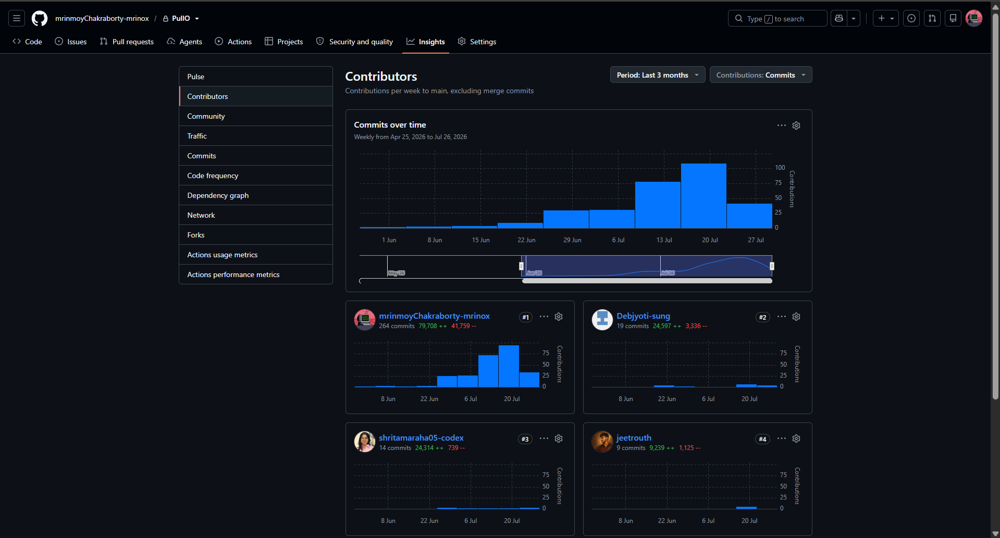
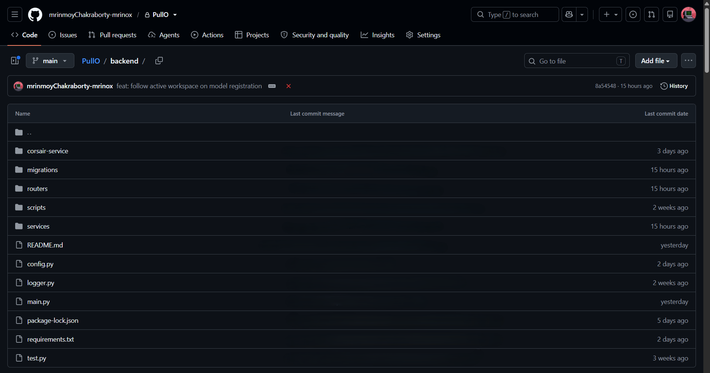

# Private Repository Verification

This document provides verifiable evidence that PullO's production backend is maintained in a private repository under active development. Source code remains closed until after evaluation; these materials confirm the repository exists, is active, and reflects the architecture described in this showcase.

---

## Repository Metadata

| Field | Value |
|-------|-------|
| **Platform** | GitHub |
| **Visibility** | Private |
| **Organization** | [mrinmoyChakraborty-mrinox](https://github.com/mrinmoyChakraborty-mrinox) |
| **Created** | June 2026 |
| **Last Commit** | Week of July 26, 2026 — active development ongoing |
| **Total Commits** | 305 (across 8 weeks, accelerating trend) |
| **Branches** | _— set this from the repo page —_ |
| **Contributors** | _— set this from Insights → Contributors —_ |
| **Languages** | _— set this from the repo page language bar —_ |

### Commit Velocity

```
Week of       Commits
─────────────────────
Jun 07            3     █
Jun 14            4     ██
Jun 21            9     ████
Jun 28           30     ██████████████
Jul 05           31     ███████████████
Jul 12           78     ████████████████████████████████████████
Jul 19          109     ██████████████████████████████████████████████████████
Jul 26           41     ████████████████████
─────────────────────
Total: 305 commits · 8 weeks (hackathon period)
```

Data sourced from the private repository's Insights page.

---

## Screenshots

### Repository Overview



### Recent Activity (Pulse)



### Pull Requests



### Contributors



### Backend File Structure

The backend directory structure maps directly to the architecture described in this showcase.



<details>
<summary><b>How this maps to the architecture</b></summary>

| Directory | Architecture Role |
|-----------|------------------|
| `routers/` | API route handlers (v1 OpenAI-compatible, extension WebSocket, dashboard) |
| `services/` | Business logic (auth, rate limiting, connection management, MCP gateway) |
| `corsair-service/` | Node.js MCP (Model Context Protocol) tool gateway |
| `migrations/` | Database schema versioning |
| `scripts/` | Operational tooling |

</details>

---

## Video Walkthrough

A short walkthrough of the private repository on GitHub — showing the repo landing page, branch list, recent commits, and contributor graph — without exposing any source code.

<video src="https://raw.githubusercontent.com/mrinmoyChakraborty-mrinox/PullO-Showcase/main/media/repo.mp4" controls width="100%">
  Your browser does not support the video tag. <a href="https://raw.githubusercontent.com/mrinmoyChakraborty-mrinox/PullO-Showcase/main/media/repo.mp4">Download the video</a>.
</video>

---

## How to Verify

1. Visit [github.com/mrinmoyChakraborty-mrinox](https://github.com/mrinmoyChakraborty-mrinox)
2. The private repository is visible to authenticated members of the organization
3. Cross-reference the commit activity dates with the development timeline
4. Compare the backend structure shown above with the architecture diagrams in [`/diagrams/`](../diagrams/)

---

*This evidence is provided for evaluation purposes only. Source code remains proprietary.*
